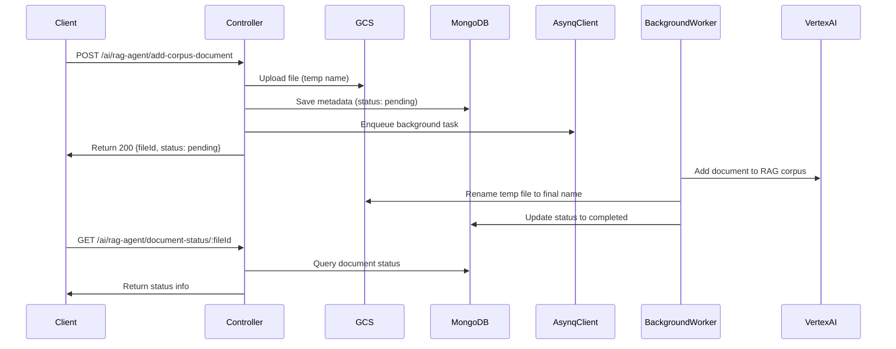
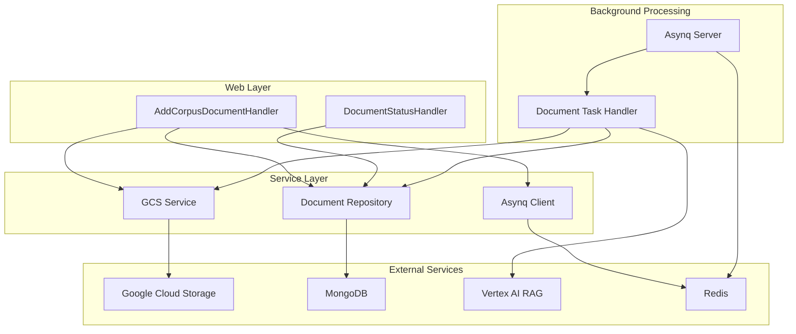
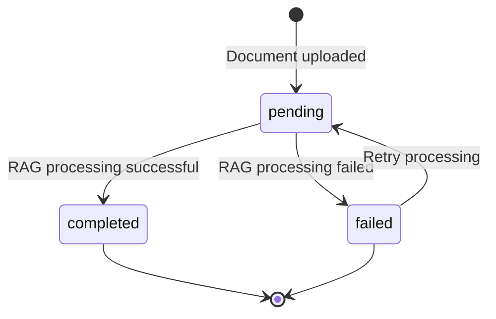
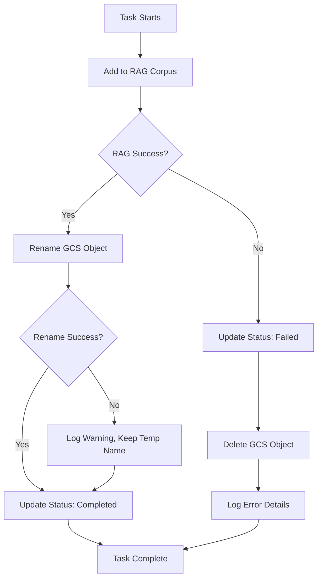

# Design Document

## Overview

This design implements an asynchronous document processing system using Asynq to replace the current synchronous AddCorpusDocumentHandler. The system separates the immediate file upload and metadata storage from the slow RAG corpus ingestion process, providing users with immediate feedback while processing documents in the background.

## Architecture

### High-Level Flow



### Component Architecture



## Components and Interfaces

### 1. Enhanced Document Model

**File:** `internal/model/document.go`

```go
type Document struct {
    FileID      string    `bson:"fileId" json:"fileId"`
    DisplayName string    `bson:"displayName" json:"displayName"`
    GCSBucket   string    `bson:"gcsBucket" json:"gcsBucket"`
    GCSObject   string    `bson:"gcsObject" json:"gcsObject"`
    ContentType string    `bson:"contentType" json:"contentType"`
    Size        int64     `bson:"size" json:"size"`
    CorpusName  string    `bson:"corpusName" json:"corpusName"`
    RAGFileID   string    `bson:"ragFileId" json:"ragFileId"`
    UploadedBy  string    `bson:"uploadedBy" json:"uploadedBy"`
    CreatedAt   time.Time `bson:"createdAt" json:"createdAt"`
    
    // New fields for async processing
    Status      string    `bson:"status" json:"status"`           // "pending", "completed", "failed"
    UpdatedAt   time.Time `bson:"updatedAt" json:"updatedAt"`
    ErrorMsg    string    `bson:"errorMsg,omitempty" json:"errorMsg,omitempty"`
}
```

### 2. Enhanced Document Repository

**File:** `internal/repository/document_repository.go`

```go
type DocumentRepository interface {
    CreateDocument(ctx context.Context, doc *Document) error
    GetDocumentByFileID(ctx context.Context, fileID string) (*Document, error)
    UpdateStatus(ctx context.Context, fileID string, status string, errorMsg string) error
    UpdateFields(ctx context.Context, fileID string, updates bson.M) error
    // ... existing methods
}
```

### 3. Enhanced GCS Service

**File:** `internal/service/gcs_service.go`

```go
type GCSService interface {
    UploadFileWithCustomName(ctx context.Context, file io.Reader, objectName string, contentType string, originalFilename string) (int64, error)
    RenameObject(ctx context.Context, oldName string, newName string) error
    DeleteObject(ctx context.Context, objectName string) error
    // ... existing methods
}
```

### 4. Background Task Implementation

**File:** `tasks/document_tasks.go`

```go
const TypeAddDocumentToCorpus = "add:document_to_corpus"

type DocumentTaskPayload struct {
    FileID          string `json:"file_id"`
    TempObjectName  string `json:"temp_object_name"`
    FinalObjectName string `json:"final_object_name"`
    CorpusName      string `json:"corpus_name"`
    DisplayName     string `json:"display_name"`
}

func NewAddDocumentToCorpusTask(payload DocumentTaskPayload) (*asynq.Task, error)
func HandleAddDocumentToCorpusTask(ctx context.Context, t *asynq.Task) error
```

### 5. Asynq Server Configuration

**File:** `internal/service/asynq_server.go`

```go
type AsynqServer struct {
    server *asynq.Server
    mux    *asynq.ServeMux
}

func NewAsynqServer(redisAddr string, concurrency int) *AsynqServer
func (s *AsynqServer) RegisterHandlers()
func (s *AsynqServer) Start() error
func (s *AsynqServer) Stop()
```

### 6. Updated Controller Methods

**File:** `internal/controller/ai/document_controller.go`

- `AddCorpusDocumentHandler`: Modified for async processing
- `GetDocumentStatusHandler`: New endpoint for status checking

## Data Models

### Document Status States



### Task Payload Structure

```json
{
    "file_id": "uuid-string",
    "temp_object_name": "temp/uuid.pdf",
    "final_object_name": "documents/rag-file-id.pdf",
    "corpus_name": "my-corpus",
    "display_name": "original-filename.pdf"
}
```

## Error Handling

### Error Categories

1. **Upload Errors**: File validation, GCS upload failures
2. **Database Errors**: MongoDB connection, document creation failures
3. **Task Enqueue Errors**: Redis connection, task serialization failures
4. **Background Processing Errors**: RAG ingestion, GCS operations, status updates

### Rollback Strategy



### Error Recovery

- **Temporary GCS failures**: Retry with exponential backoff
- **RAG ingestion failures**: Clean up GCS file, update status with error details
- **Database update failures**: Log errors, rely on task retry mechanism
- **Partial failures**: Continue processing where possible, log warnings

## Testing Strategy

### Unit Tests

1. **Model Tests**: Document struct validation, field constraints
2. **Repository Tests**: CRUD operations, status updates, error handling
3. **Service Tests**: GCS operations, file upload/rename/delete
4. **Task Tests**: Payload serialization, handler logic, error scenarios

### Integration Tests

1. **End-to-End Flow**: Complete async processing workflow
2. **Error Scenarios**: Network failures, service unavailability
3. **Concurrency Tests**: Multiple simultaneous uploads
4. **Status Tracking**: Verify status updates throughout processing

### Performance Tests

1. **Load Testing**: Multiple concurrent document uploads
2. **Background Processing**: Task queue performance under load
3. **Resource Usage**: Memory and CPU usage during processing
4. **Timeout Handling**: Long-running RAG ingestion scenarios

## Configuration

### Environment Variables

```bash
# Existing
GCS_BUCKET_NAME=my-bucket
GOOGLE_CLOUD_PROJECT=my-project
GOOGLE_CLOUD_LOCATION=us-central1

# New for Asynq
REDIS_ADDR=localhost:6379
ASYNQ_CONCURRENCY=10
ASYNQ_RETRY_DELAY=60s
ASYNQ_MAX_RETRIES=3
```

### Redis Configuration

- **Queue**: Default Asynq queue for document processing tasks
- **Retention**: Failed tasks retained for 24 hours for debugging
- **Monitoring**: Asynq web UI for task monitoring and management

## Security Considerations

1. **File Validation**: Strict file type and size validation before processing
2. **Temporary Files**: Secure temporary naming to prevent conflicts
3. **Error Messages**: Sanitized error messages to prevent information leakage
4. **Access Control**: Proper authentication for status endpoint
5. **Resource Limits**: Task timeout and memory limits to prevent abuse

## Monitoring and Observability

### Metrics

- Document upload success/failure rates
- Background task processing times
- Queue depth and processing lag
- Error rates by category

### Logging

- Structured logging with correlation IDs
- Task lifecycle events (enqueue, start, complete, fail)
- Performance metrics (upload time, processing time)
- Error details with context for debugging

### Alerting

- High error rates in document processing
- Queue backup beyond threshold
- GCS or MongoDB connectivity issues
- Task processing timeouts